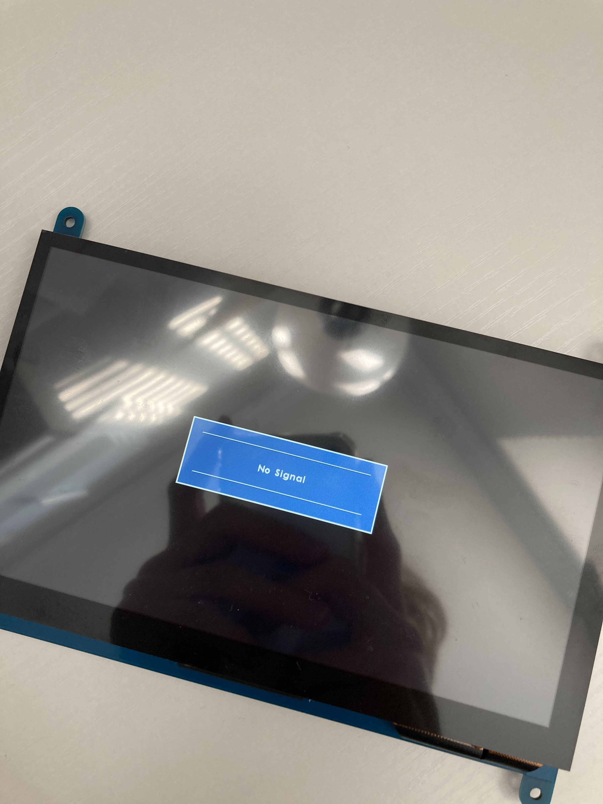
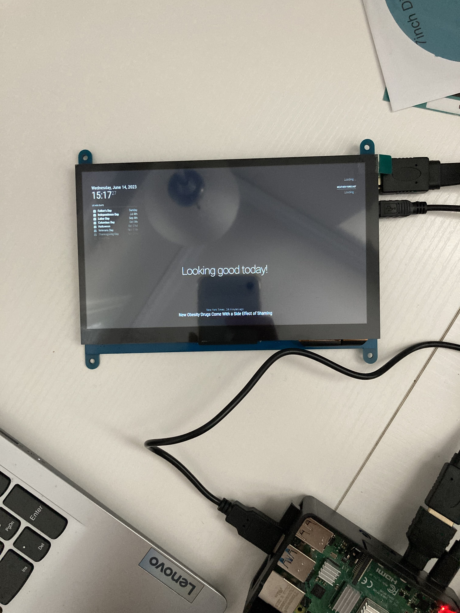

# Smart Mirror
In this project, I designed and constructed a Smart Mirror using a Raspberry Pi 4. This ingenious device goes beyond a simple reflection; it delivers real-time updates on weather, news, reminders, and more, embedded subtly into the mirror's interface. As you explore my portfolio, imagine a mirror that doesn't just reflect your image, but also keeps you informed and organized, making your day a little bit smoother.

| **Engineer** | **School** | **Area of Interest** | **Grade** |
|:--:|:--:|:--:|:--:|
| Yuki O. | Evergreen Valley High School | Engineering | Incoming Junior

**Replace the BlueStamp logo below with an image of yourself and your completed project. Follow the guide [here](https://tomcam.github.io/least-github-pages/adding-images-github-pages-site.html) if you need help.**


  
# Final Milestone
For your final milestone, explain the outcome of your project. Key details to include are:
- What you've accomplished since your previous milestone
- What your biggest challenges and triumphs were at BSE
- A summary of key topics you learned about
- What you hope to learn in the future after everything you've learned at BSE

**Don't forget to replace the text below with the embedding for your milestone video. Go to Youtube, click Share -> Embed, and copy and paste the code to replace what's below.**

<iframe width="560" height="315" src="https://www.youtube.com/embed/F7M7imOVGug" title="YouTube video player" frameborder="0" allow="accelerometer; autoplay; clipboard-write; encrypted-media; gyroscope; picture-in-picture; web-share" allowfullscreen></iframe>

# Second Milestone
Since the first milestone, I have made considerable strides in enhancing the functionality of my Magic Mirror project. My primary focus has been on integrating third-party modules to improve the utility and personalization of the device, as well as improving the overall visual aesthetics.
- I've successfully integrated third-party modules such as the cryptocurrency, wifi qr code, and weather module to extend the capabilities of my Magic Mirror beyond the default MagicMirror features. The Wi-Fi QR Code module is a significant addition, creating a QR code displayed on the mirror's screen that allows guests to easily connect to our Wi-Fi network. Instead of sharing a Wi-Fi password verbally or via text, the user can simply scan the QR code to gain access to the network. Another module I've incorporated displays live cryptocurrency prices for Bitcoin, Ethereum, and Litecoin. This feature is especially useful for cryptocurrency enthusiasts like me, who wish to keep track of market fluctuations in real time. In addition to customizing the layout and appearance of these modules, I've also corrected the timezone to ensure the displayed information is accurate and timely.
- A surprise that I encountered during this second week of my project was,
- Previous challenges you faced that you overcame
- What needs to be completed before your final milestone 

**Don't forget to replace the text below with the embedding for your milestone video. Go to Youtube, click Share -> Embed, and copy and paste the code to replace what's below.**

<iframe width="560" height="315" src="https://www.youtube.com/embed/y3VAmNlER5Y" title="YouTube video player" frameborder="0" allow="accelerometer; autoplay; clipboard-write; encrypted-media; gyroscope; picture-in-picture; web-share" allowfullscreen></iframe>

# First Milestone
For my first milestone, I intended to set up the raspberry pi and the monitor.
The Raspberry Pi 4 serves as the brain of the project, fetching and processing data from various sources. The monitor is the channel through which the Raspberry Pi communicates with the user, displaying all the necessary information.
- So far, I have successfully set up the Raspberry Pi 4 and connected it to the monitor. I have also loaded the Raspberry Pi OS onto the SD card and successfully booted up the system. I have already installed MagicMirror², an open-source modular smart mirror platform, and am in the works of changing the UI.
- One of the significant challenges I've faced was finding out which cable was the correct one for each input and output. For example, I connected the ethernet cable to the HDMI cable which surprisingly worked but showed the most unpleasant display. I later got help and realized I had to change it to the HDMI cable that I hadn't used yet.
- To complete my project, the next steps involve physically assembling the Raspberry Pi, monitor, and two-way mirror into a single unit that maintains both functionality and aesthetic appeal. On the software side, I plan to customize the MagicMirror² interface to display useful modules, like the weather, news, calendar, and reminders.

  
  

**Don't forget to replace the text below with the embedding for your milestone video. Go to Youtube, click Share -> Embed, and copy and paste the code to replace what's below.**

<iframe width="560" height="315" src="https://youtu.be/ivQNfdy_SU8" title="YouTube video player" frameborder="0" allow="accelerometer; autoplay; clipboard-write; encrypted-media; gyroscope; picture-in-picture; web-share" allowfullscreen></iframe>

# Schematics 
Here's where you'll put images of your schematics. [Tinkercad](https://www.tinkercad.com/blog/official-guide-to-tinkercad-circuits) and [Fritzing](https://fritzing.org/learning/) are both great resoruces to create professional schematic diagrams, though BSE recommends Tinkercad becuase it can be done easily and for free in the browser. 

# Code
Here's where you'll put your code. The syntax below places it into a block of code. Follow the guide [here]([url](https://www.markdownguide.org/extended-syntax/)) to learn how to customize it to your project needs. 

```c++
void setup() {
  // put your setup code here, to run once:
  Serial.begin(9600);
  Serial.println("Hello World!");
}

void loop() {
  // put your main code here, to run repeatedly:

}
```

# Bill of Materials
Here's where you'll list the parts in your project. To add more rows, just copy and paste the example rows below.
Don't forget to place the link of where to buy each component inside the quotation marks in the corresponding row after href =. Follow the guide [here]([url](https://www.markdownguide.org/extended-syntax/)) to learn how to customize this to your project needs. 

| **Part (Item Name)** | **Note (Purpose)** | **Price** | **Link** |
|:--:|:--:|:--:|:--:|
|7 inch IPS monitor|The monitor serves as the display component of the mirror|$46|<a href="https://www.amazon.com/Hosyond-Display-1024%C3%97600-Capacitive-Raspberry/dp/B09XKC53NH/ref=sr_1_3?crid=1KKB9WC62OIAD&keywords=raspberry%2Bpi%2Bips&qid=1685911698&s=electronics&sprefix=raspberry%2Bpi%2Bips%2B%2Celectronics%2C87&sr=1-3&th=1"> Link </a>|
| Raspberry Pi 4 Starter Kid | The Raspberry Pi 4 is the hardware for the mirror | $119 | <a href="https://www.canakit.com/raspberry-pi-4-starter-kit.html"> Link </a> |
|Acrylic Mirror|Reflective Surafacefor Smart Mirror|$15| <a href="https://www.amazon.com/Acrylic-Mirror-Sheets-Shatter-Resistant/dp/B08FR2W6M1/ref=sr_1_5?keywords=7+inch+2+way+mirror&qid=1687360352&sr=8-5"> Link </a> |
| 7 inch case | Frame for the monitor | $12 | <a href="https://www.amazon.com/Longruner-Raspberry-Various-Systems-LSC7B-1/dp/B07KRX3QCQ/ref=pd_bxgy_vft_none_sccl_1/142-0985611-7894557?pd_rd_w=iX9Wr&content-id=amzn1.sym.26a5c67f-1a30-486b-bb90-b523ad38d5a0&pf_rd_p=26a5c67f-1a30-486b-bb90-b523ad38d5a0&pf_rd_r=M5D9MWHEWDJDJ7RF6NEH&pd_rd_wg=4ZJB4&pd_rd_r=d39acf82-1e09-4218-b1d1-e74f0d003902&pd_rd_i=B07KRX3QCQ&psc=1"> Link </a> |
|USB Microphone|Micrphone for voice recognition|$8|<a href="https://www.amazon.com/Newest-YOUMI-Microphone-Laptop-desktop/dp/B01MQ2AA0X/ref=sr_1_5?crid=XFAUZ25ZOYNM&keywords=small+usb+microphone&qid=1687301728&sprefix=small+usb+microphon%2Caps%2C166&sr=8-5"> Link </a> ||
|USB Speaker|Speaker for audio|$13|<a href="https://www.amazon.com/HONKYOB-Speaker-Computer-Multimedia-Notebook/dp/B075M7FHM1/ref=sr_1_5?crid=2RXCQXXI188X0&keywords=small+usb+speaker&qid=1687301696&sprefix=small+usb+speaker%2Caps%2C145&sr=8-5"> Link </a> |

# Other Resources/Examples
One of the best parts about Github is that you can view how other people set up their own work. Here are some past BSE portfolios that are awesome examples. You can view how they set up their portfolio, and you can view their index.md files to understand how they implemented different portfolio components.
- [Example 1](https://trashytuber.github.io/YimingJiaBlueStamp/)
- [Example 2](https://sviatil0.github.io/Sviatoslav_BSE/)
- [Example 3](https://arneshkumar.github.io/arneshbluestamp/)

To watch the BSE tutorial on how to create a portfolio, click here.
