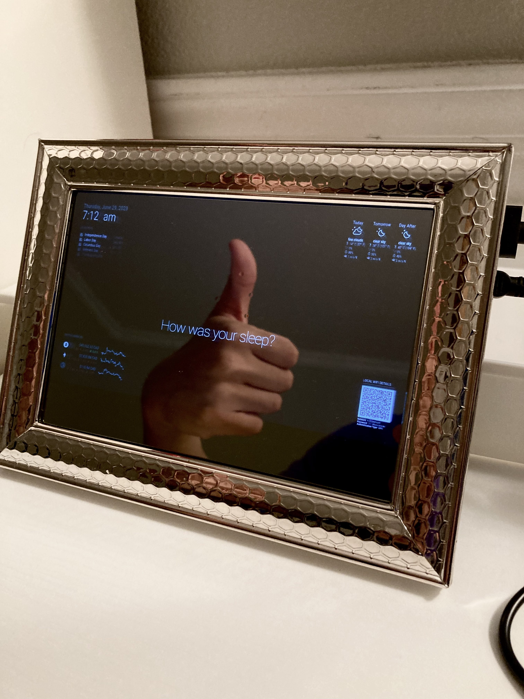
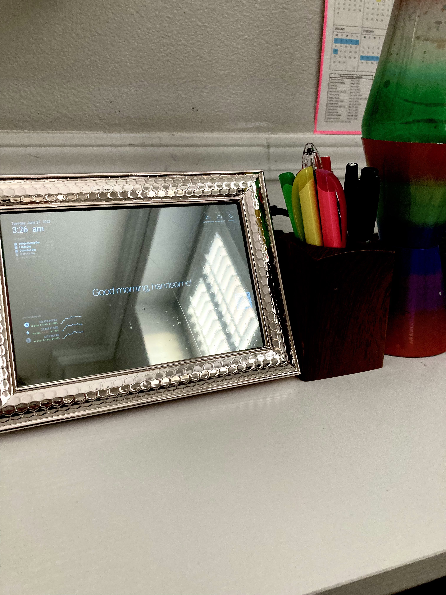
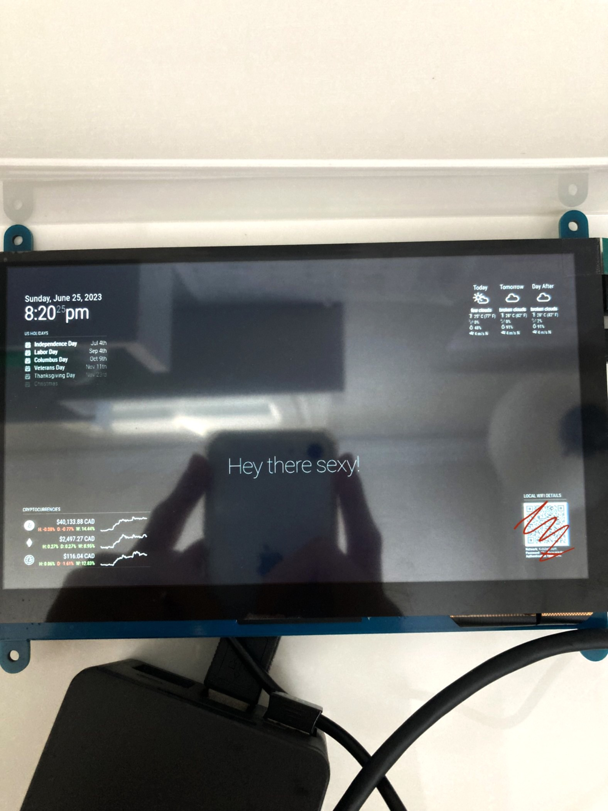
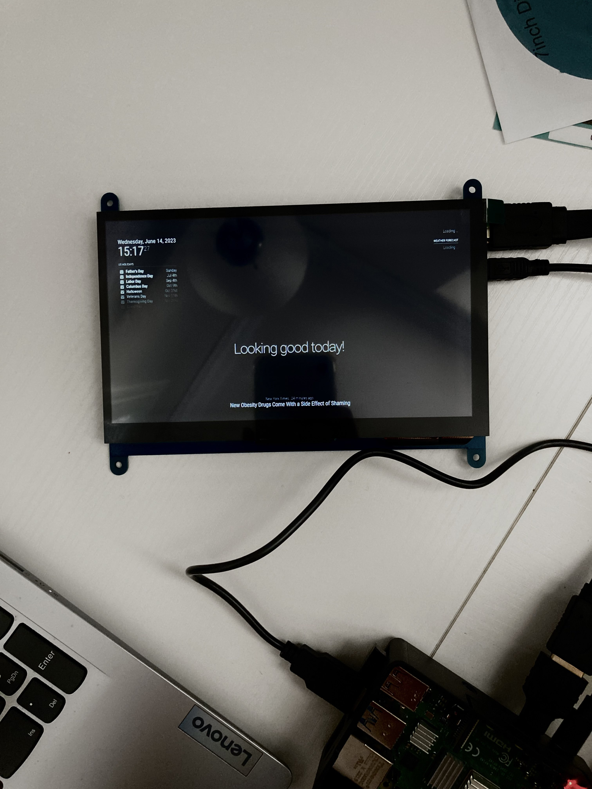
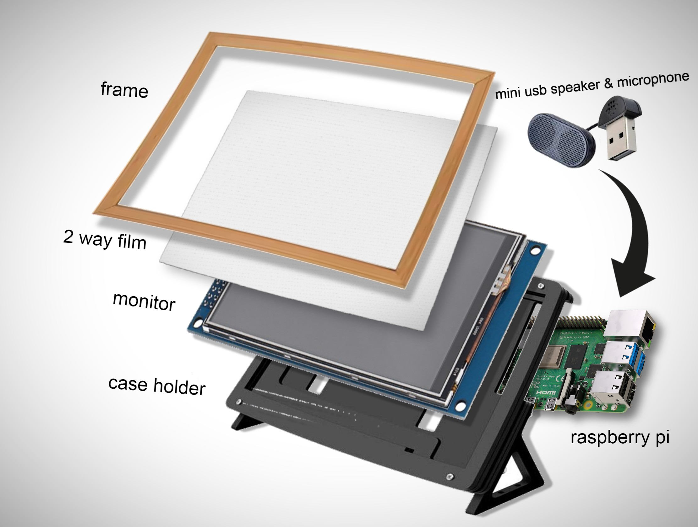

# Raspberry Pi Magic Mirror
In this project, I designed and constructed a Smart Mirror using a Raspberry Pi 4. This ingenious device goes beyond a simple reflection; it delivers real-time updates on weather, news, reminders, and more, embedded subtly into the mirror's interface. As you explore my portfolio, imagine a mirror that doesn't just reflect your image, but also keeps you informed and organized, making your day a little bit smoother.

| **Engineer** | **School** | **Area of Interest** | **Grade** |
|:--:|:--:|:--:|:--:|
| Yuki O. | Evergreen Valley High School | Engineering | Incoming Junior



  
# Final Milestone
- Since the last milestone, my Smart Mirror project has achieved significant progress. I successfully assembled the monitor case holder and two-way mirror into a single cohesive unit, that is both functional and visually appealing.
  
- One of the biggest challenges was understanding and resolving hardware integration issues. I faced hurdles in correctly setting up the frame, case, and two-way mirror together during the initial stages which led to a few setbacks in time. However, overcoming these challenges has been a major triumph.

- This project provided me with a profound learning experience. It offered a deep dive into Raspberry Pi and its use in real-world projects, broadening my understanding of this powerful tool. I also gained practical experience in working with the MagicMirror² platform and discovered its potential in creating personalized smart devices. Learning about the integration of third-party modules, understanding their workings, and resolving potential conflicts also gave me hands-on experience with software customization and optimization.

- Building on what I've learned, I'm interested in further exploring how to add more functionality to the Magic Mirror. For instance, incorporating voice control or gesture recognition could make the mirror even more interactive and user-friendly.



<iframe width="560" height="315" src="https://www.youtube.com/embed/RmvWkA4qCiQ" title="YouTube video player" frameborder="0" allow="accelerometer; autoplay; clipboard-write; encrypted-media; gyroscope; picture-in-picture; web-share" allowfullscreen></iframe>

# Second Milestone
- Since achieving the first milestone, I have made significant strides in enhancing the functionality of my Magic Mirror project.
My main focus has been on integrating third-party modules to improve the device's utility and personalization, while also giving attention to its visual aesthetics.

- I'm excited to share that I have successfully integrated various third-party modules into my Magic Mirror. These include the cryptocurrency module, the Wi-Fi QR code module, and the weather module.
By incorporating these modules, I have expanded the capabilities of my Magic Mirror beyond the default features provided by MagicMirror². For instance, the Wi-Fi QR Code module generates a QR code on the mirror's screen, allowing guests to effortlessly connect to our Wi-Fi network by simply scanning the code. This eliminates the need to verbally share the Wi-Fi password or send it via text.

- Additionally, I have integrated a module that displays real-time cryptocurrency prices for popular coins like Bitcoin, Ethereum, and Litecoin. This feature is particularly useful for cryptocurrency enthusiasts who want to stay updated on market fluctuations.

- To ensure seamless integration, I have also customized the layout and appearance of these modules. Furthermore, I have addressed the issue of incorrect time zones to ensure that the displayed information is always accurate and timely.

- Throughout this journey, I encountered an unexpected challenge when selecting the correct API key for the weather module. The provided list included locations with similar names but different coordinates. To overcome this hurdle, I conducted thorough research, ensuring that I selected the precise location settings.

- In my initial milestone, I faced a major challenge in correctly connecting the cables for the appropriate input and output. However, I have now become well-acquainted with the hardware and successfully overcome these initial difficulties.




<iframe width="560" height="315" src="https://www.youtube.com/embed/l_N8yBcJbkE" title="YouTube video player" frameborder="0" allow="accelerometer; autoplay; clipboard-write; encrypted-media; gyroscope; picture-in-picture; web-share" allowfullscreen></iframe>

# First Milestone
- For my first milestone, the objective was to set up the Raspberry Pi and the monitor. The Raspberry Pi 4 serves as the central processing unit, responsible for fetching and processing data from various sources. Meanwhile, the monitor serves as the interface through which the Raspberry Pi communicates with the user, displaying all the necessary information.

- I am pleased to share that I have successfully completed the setup process for the Raspberry Pi 4 and have connected it to the monitor. Furthermore, I have successfully loaded the Raspberry Pi OS onto the SD card and successfully booted up the system.

- As part of the setup, I have also installed MagicMirror², an open-source modular smart mirror platform, and I am currently in the process of modifying the user interface to align with my desired vision.

- During this milestone, I encountered a significant challenge in identifying the correct cables for each input and output. In one instance, I mistakenly connected the Ethernet cable to the HDMI port, which resulted in a rather unpleasant display. However, with the guidance and assistance I received, I realized my error and rectified it by connecting the unused HDMI cable instead.

- Moving forward, the completion of my project entails physically assembling the Raspberry Pi, monitor, and two-way mirror into a unified unit that seamlessly combines functionality and aesthetic appeal. On the software front, my plan is to further customize the MagicMirror² interface, incorporating useful modules such as weather updates, news feeds, calendar integration, and reminders.

- With each milestone achieved, I am getting closer to realizing the full potential of my Magic Mirror project. I remain committed to ensuring a polished and sophisticated final result that not only fulfills its intended purpose but also captivates and enhances the user's experience.



<iframe width="560" height="315" src="https://www.youtube.com/embed/ivQNfdy_SU8" title="YouTube video player" frameborder="0" allow="accelerometer; autoplay; clipboard-write; encrypted-media; gyroscope; picture-in-picture; web-share" allowfullscreen></iframe>

# Schematics 
This is a deconstructed model of the smart mirror.



# Code
This is my config.js for the smart mirror with a brief explanation for each module.

```js
let config = {
  address: "localhost",
  port: 8080,
  basePath: "/",
  ipWhitelist: ["127.0.0.1", "::ffff:127.0.0.1", "::1"],
  useHttps: false,
  httpsPrivateKey: "",
  httpsCertificate: "",
  language: "en",
  locale: "en-US",
  logLevel: ["INFO", "LOG", "WARN", "ERROR"],
  timeFormat: 12,
  units: "imperial",
  modules: [
    {
      module: "alert",
    },
    {
      module: "updatenotification",
      position: "top_bar"
    },
    {
      module: "clock",
      position: "top_left"
    },
    {
      module: "calendar",
      header: "US Holidays",
      position: "top_left",
      config: {
        calendars: [
          {
            symbol: "calendar-check",
            url: "webcal://www.calendarlabs.com/ical-calendar/ics/76/US_Holidays.ics"
          }
        ]
      }
    },
    {
      module: "compliments",
      position: "lower_third"
    },
    {
      module: "MMM-3Day-Forecast",
      position: "top_right",
      config: {
        api_key: "41440a1273ddddfdeae229bf83f1af2e",
        lat: 37.3397352,
        lon: -121.894958,
        units: "M",
        lang: "en",
        interval: 900000
      }
    },
    {
      module: "MMM-WiFiPassword",
      position: "bottom_right",
      config: {
        network: "YourNetworkName",
        password: "YourPassword",
      }
    },
    {
      module: "MMM-CoinMarketCap",
      position: "bottom_left",
      header: "Cryptocurrencies",
      config: {
        apiKey: "62309cc4-b03f-4fb1-90d2-6e7e564bc169",
        currencies: ["bitcoin", "ethereum", "litecoin", "ripple"],
        view: "graphWithChanges",
        conversion: "CAD"
        <!-- See below for more Configuration Options -->
      }
    }
  ]
};

module.exports = config;

-----------------------------------------------------------------------------------------------------------------------------
module: "alert": This is the default alert module for MagicMirror² that allows other modules to send notifications to alert the user.

module: "updatenotification": This module is positioned at the top bar. It checks if there are updates available for your MagicMirror² application.

module: "clock": This module is placed at the top left. As the name suggests, it displays the current time.

module: "calendar": This module, also positioned at the top left, displays a calendar with US Holidays. It fetches data from an iCalendar (ics) file provided in the URL. The symbol: "calendar-check" will display a specified icon next to each event.

module: "compliments": Placed in the lower third of the screen, this module shows random compliments to the user at different times of the day.

module: "MMM-3Day-Forecast": This module, positioned at the top right, uses an API key to fetch a 3-day weather forecast for a specified latitude and longitude. It updates at an interval of 900,000 milliseconds, or 15 minutes.

module: "MMM-WiFiPassword": Positioned at the bottom right, this module displays a QR code for connecting to your specified Wi-Fi network. By scanning the QR code with a smartphone, users can connect to the Wi-Fi network without needing to type the password.

module: "MMM-CoinMarketCap": Positioned at the bottom left, this module displays live price updates for specified cryptocurrencies (Bitcoin, Ethereum, Litecoin, Ripple). The information is displayed as a graph with changes, and currency conversion is set to Canadian Dollars (CAD).
```

# Bill of Materials
Here are all the resources/materials I used for this project with each product's purpose listed. Links and pricing are also included.

| **Part (Item Name)** | **Note (Purpose)** | **Price** | **Link** |
|:--:|:--:|:--:|:--:|
|7 inch IPS monitor|The monitor serves as the display component of the mirror|$46|<a href="https://www.amazon.com/Hosyond-Display-1024%C3%97600-Capacitive-Raspberry/dp/B09XKC53NH/ref=sr_1_3?crid=1KKB9WC62OIAD&keywords=raspberry%2Bpi%2Bips&qid=1685911698&s=electronics&sprefix=raspberry%2Bpi%2Bips%2B%2Celectronics%2C87&sr=1-3&th=1"> Link </a>|
| Raspberry Pi 4 Starter Kid | The Raspberry Pi 4 is the hardware for the mirror | $119 | <a href="https://www.canakit.com/raspberry-pi-4-starter-kit.html"> Link </a> |
|Acrylic Mirror|Reflective Surafacefor Smart Mirror|$15| <a href="https://www.amazon.com/Acrylic-Mirror-Sheets-Shatter-Resistant/dp/B08FR2W6M1/ref=sr_1_5?keywords=7+inch+2+way+mirror&qid=1687360352&sr=8-5"> Link </a> |
| 7 inch case | Frame for the monitor | $12 | <a href="https://www.amazon.com/Longruner-Raspberry-Various-Systems-LSC7B-1/dp/B07KRX3QCQ/ref=pd_bxgy_vft_none_sccl_1/142-0985611-7894557?pd_rd_w=iX9Wr&content-id=amzn1.sym.26a5c67f-1a30-486b-bb90-b523ad38d5a0&pf_rd_p=26a5c67f-1a30-486b-bb90-b523ad38d5a0&pf_rd_r=M5D9MWHEWDJDJ7RF6NEH&pd_rd_wg=4ZJB4&pd_rd_r=d39acf82-1e09-4218-b1d1-e74f0d003902&pd_rd_i=B07KRX3QCQ&psc=1"> Link </a> |
|USB Microphone|Micrphone for voice recognition|$8|<a href="https://www.amazon.com/Newest-YOUMI-Microphone-Laptop-desktop/dp/B01MQ2AA0X/ref=sr_1_5?crid=XFAUZ25ZOYNM&keywords=small+usb+microphone&qid=1687301728&sprefix=small+usb+microphon%2Caps%2C166&sr=8-5"> Link </a> ||
|USB Speaker|Speaker for audio|$13|<a href="https://www.amazon.com/HONKYOB-Speaker-Computer-Multimedia-Notebook/dp/B075M7FHM1/ref=sr_1_5?crid=2RXCQXXI188X0&keywords=small+usb+speaker&qid=1687301696&sprefix=small+usb+speaker%2Caps%2C145&sr=8-5"> Link </a> |

